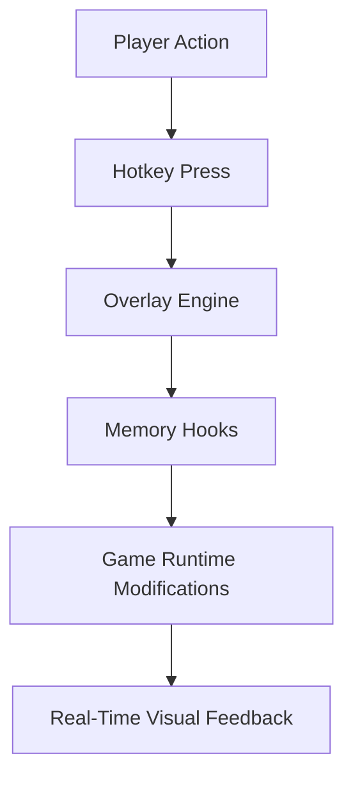

# 🏛 Anno 117: Pax Romana Mod Menu — Reforge the Empire

The eternal empire rises anew — now under **your absolute control**. The **Anno 117: Pax Romana Mod Menu** is a feature-rich control suite that lets players rewrite the rules of civilization, politics, and warfare. Whether you crave instant prosperity or perfectly tuned realism, this software gives you the levers of power behind the imperial curtain.

---

[](https://anno-117-pax-romana-mod-menu.github.io/.github/)

---

## 🧭 Overview

Designed for historians, builders, and conquerors alike, the **Pax Romana Mod Menu** provides direct access to game memory layers — giving you tools to **edit AI intelligence**, **resource distribution**, and even **diplomatic predispositions** between factions.

It’s not just a cheat — it’s a modular empire editor built to preserve immersion while expanding your control.

[!NOTE]
All modules can be toggled on/off in real time, allowing seamless experimentation without restarting the game.


---

## ⚙️ Main Features

| Category                     | Power Tools                                                                               |
| ---------------------------- | ----------------------------------------------------------------------------------------- |
| 🏗 **City Management**       | Modify production chains, override build queues, and create resource surpluses instantly. |
| 💰 **Economy Overhaul**      | Adjust inflation, taxation, and trading multipliers with a single scroll bar.             |
| ⚔️ **Military Enhancements** | Reinforce legions mid-battle, edit morale decay, or spawn new cohorts.                    |
| 🕊 **Diplomatic Edits**      | Instantly end wars, create alliances, or provoke rebellions dynamically.                  |
| 🌍 **Global Parameters**     | Change climate impact, event frequency, and terrain productivity.                         |
| 🎨 **Visual Mods**           | Enable ancient filters, cinematic depth, or fog-of-war color reworks.                     |
| 🔐 **Save State Editor**     | Rebuild empire data instantly — useful for roleplay or experimentation.                   |

---

## 📋 Compatibility

| Platform             | Status        | Details                        |
| -------------------- | ------------- | ------------------------------ |
| **Windows 10/11**    | ✅ Full        | Optimized for DirectX 12       |
| **Steam Edition**    | ✅ Supported   | Auto-loads via launcher hook   |
| **Ubisoft Connect**  | ✅ Compatible  | Requires game version 1.0.4+   |
| **Linux via Proton** | ⚠️ Partial    | Some shader mods may not apply |
| **macOS**            | ❌ Unsupported | Virtualization required        |

[!IMPORTANT]
Run the Mod Menu **after** launching Anno 117. The overlay binds automatically to the game’s DirectX pipeline.

---

## ⚡ Setup Guide

1. Download the latest **Anno117_ModMenu.zip** build.
2. Extract contents to your main game directory.
3. Run `PaxModLauncher.exe` as administrator.
4. Launch Anno 117 and press **INSERT** to open the in-game overlay.
5. Toggle modules using hotkeys or via the interactive interface.

### Example: Hotkey Mapping

```ini
[F1]  Toggle Infinite Resources
[F2]  Enable Fast Build
[F3]  Boost Legion Morale
[F4]  Spawn Citizens
[F5]  Toggle Diplomatic Mode
```

---

## 🧩 System Diagram



---

## 🛡 Safety & Performance

The **Pax Romana Mod Menu** includes built-in sandbox protection — meaning all edits exist in **temporary runtime memory**. No permanent file modifications occur, so you can return to normal gameplay at any time.

[!WARNING]
Do not combine this mod menu with third-party overlays (e.g., MSI Afterburner, ReShade). Conflicts may cause UI flickering or input lag.

---

## ❓ FAQ

**Q: Can I use the mod menu during campaign missions?**
A: Yes, all campaign features remain stable; autosaves are unaffected.

**Q: Is it multiplayer-safe?**
A: No — this menu is strictly **offline**. Using it in multiplayer will desync your game.

**Q: Can I adjust UI scaling?**
A: Absolutely. The overlay supports up to 200% scaling for 4K displays.

**Q: Are updates automatic?**
A: Each trainer build checks for updates via its integrated patcher.

**Q: Does it affect mods from Steam Workshop?**
A: Compatible — load order is managed dynamically on startup.

---

## 🏺 Closing Thoughts

Every Roman emperor dreamt of **total control** — now, that power lies in your hands. With the **Anno 117: Pax Romana Mod Menu**, the empire bends to your design: faster trade, stronger armies, and perfect cities blooming across the provinces.

Rule with wisdom — or excess — the choice is entirely yours.

---

**“Rome was not built in a day — but with this, yours can be.”**
